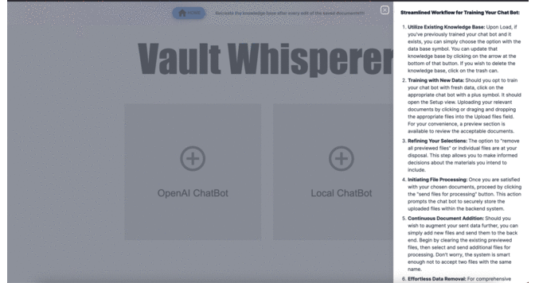
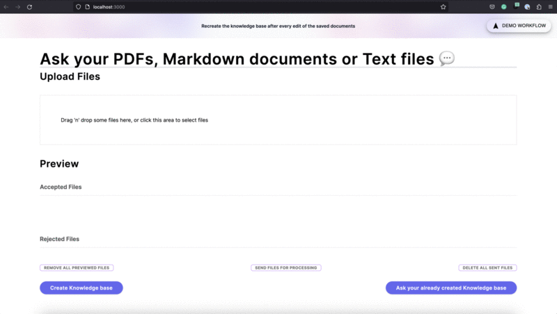

# Full Stack implementation of the Custom AI Chat Bot(Notion Chatbot)
This is a sister application to my the initial AIChatBot implementation found here: https://github.com/KobbyBawuah/AIChatBot. The aim of this version is to provide a user-friendly web interface, allowing users to simply visit a website, upload their documents, and start interacting with the chatbot powered by the OpenAI language model or a 100% private GPT. The first part of the application utilizes the OpenAI language model to generate responses to user input whereas the local version currently uses the local GPT4 LLM to generate responses. It involves loading data provided by the user, querying an index made from that data, and engaging in continuous interactions with the user. By considering both the provided chat history and the user's questions, the chatbot generates appropriate responses. In short, this app takes uploaded files, embeds them into vectors, stores them into Pinecone or a local DB, and allows semantic searching of the data whiles maintaining context over the last 10 interactions.


### Prerequisites
To run this app, you need the following:
- An [OpenAI API](https://platform.openai.com/) key: You can obtain an API key from the OpenAI website. (OPtional)-> You could consider setting the OPENAI_API_ORG.
- [Pinecone API Key](https://app.pinecone.io/organizations/-NalvPDNU4OBLzvzVC7t/projects/gcp-starter:5718e41/indexes): To use Pinecone as the vector database, you need a Pinecone API key. You will also need to set the environment. Make sure your Pinecone environment is an actual environment given to you by Pinecone, like `us-west4-gcp-free`.

# Up and Running (Developer)
To run the app locally, follow these steps:

Clone this repository:
```bash
git clone https://github.com/KobbyBawuah/Fullstack-Notion-Chatbot.git
cd Fullstack-Notion-Chatbot
```

Install the dependencies using either NPM or Yarn:
```bash
npm install
```

Copy the details of .example.env.local to a new file called .env and update it with your API keys and environment:
```bash
cp .example.env.local .env
```

Update the .env file with your actual API keys for OpenAI and Pinecone.

Make sure you are using node 18. You can run the command
```bash
nvm use 18 
```

#### Run the app:
locally:
```bash
npm run dev
```

production version:
```bash
npm run build
npm run start
```

Open http://localhost:3000 with your browser to access the application.

## If you wish use the completely private version (Highly ADVISED to run it anyway): 

Open a new terminal, change directory to the privateGPT directory and follow the README.md in that directory

# Up and Running (Website)
Not yet deployed


# Usage
1. Once the application is running, visit http://localhost:3000 in your web browser.

2. If you already have knowledge bases created, ask away. 

## Note 

If you wish to use the Bot in moderation mode, you will require internet connection and you will need to be running the privateGPT server. For moderation, it uses the OpenAI moderation end point. Ofcourse expect the bot to take a little longer to reply.

3. If you don't have knowledge bases created, you will have to attach the files you want to train your chat bot on. Adjust the attached files as needed. Sample file -> constitution.txt.

4. Upload your documents for processing. 

5. Train your chat bot on your documents by creating a knowledge base. You can select the OpenAI version which of course uses OPENAI LLM and is highly optimized but not private or you can select the completely private version but uses the GPT4All language model on your system which of course is not the most accurate or optimized. 

6. Start Interacting: The bot will show upfter it is done training. The app will use Pinecone to store document embeddings and OpenAI's language model (GPT-3) to answer your questions based on the uploaded documents.

7. To add more files to the already processed files, just don't clean the saved files and upload the new documents to retrain. 

Sample questions and their expected answers based on the custom document currently provided are as follows:
- Who is the creator of this chatbot? ---> Answer: Kwabena
- Who is his father? --> Answer: Information not provided in data
- Who wrote the constitution? ---> Answer: Kwabena
- Does he live in Nigeria? ---> Answer: No, Canada
- What did the people of the United States do in order to form a more perfect Union? --> Answer: This is just a general question to ensure functionality. 
- Summarize the constitution? --> Answer: General question as well to ensure functionality.

To exit the chatbot UI, press `Ctrl + C` in the terminal for the frontend

#### To shut down the privateGPT server
Press Ctrl + C, and then deactivate the virtual environment using the `deactivate` command in that server.

# Side Note
To adjust this bot to work with Notion there are two possible ways:

## Manual 
1. You could export the .md files from Notion and run an unzip command to insert the files into the Notion DB directory.
2. Then you could just adjust the directory path in the setup/route to point at the Notion_DB directory. 

## Automatic
1. Load and update documents from Notion using the tool in llama hub:
https://llamahub.ai/l/tools-notion 

2. Adjust the code acordingly. 

# Example of WebApp WorkFlow:



#### You could pull the alternative UI on http://localhost:3000/oldUI



## 🔗 Links
[](XXX)
[](https://www.linkedin.com/in/kwabena-g-bawuah/)